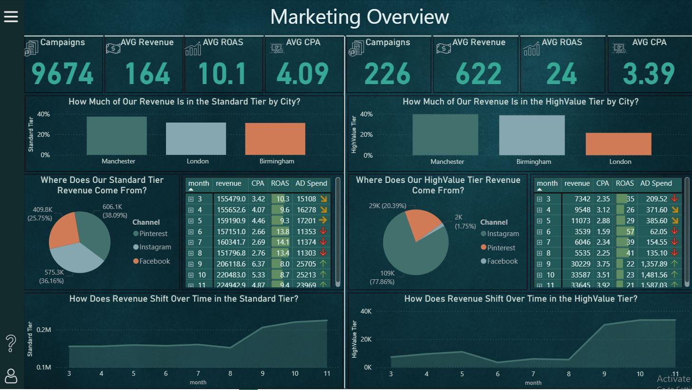
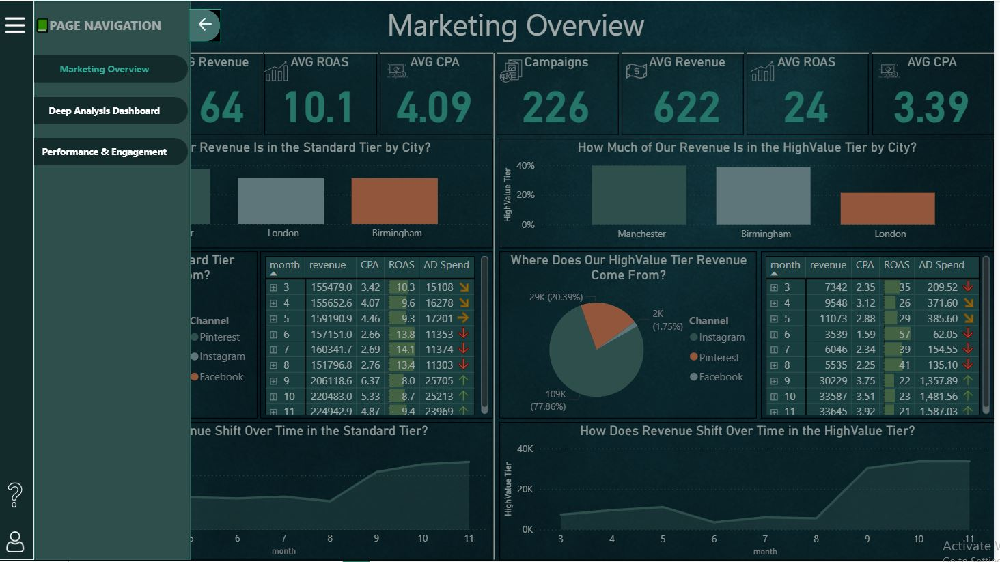
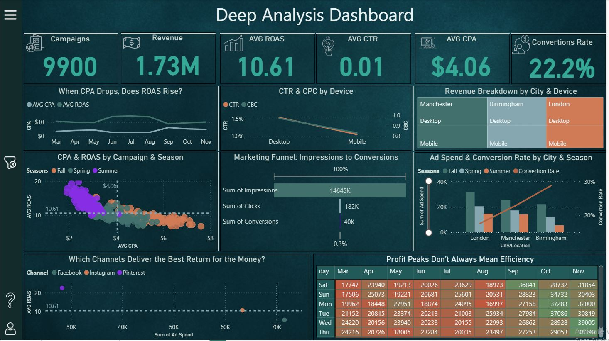
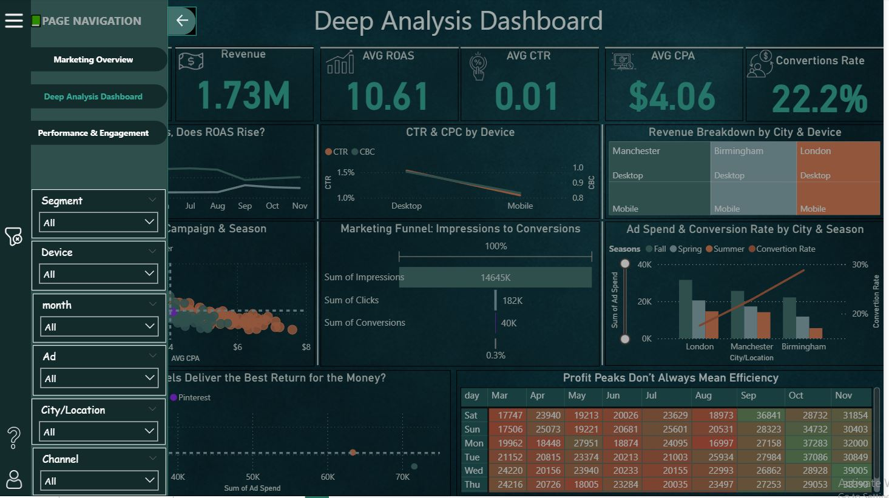
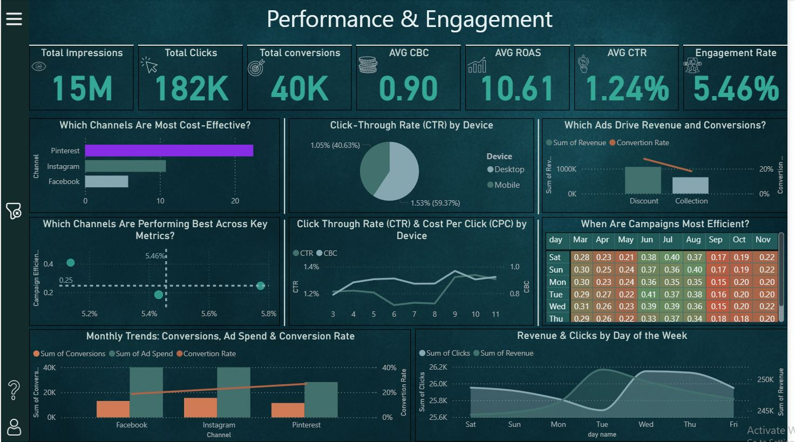
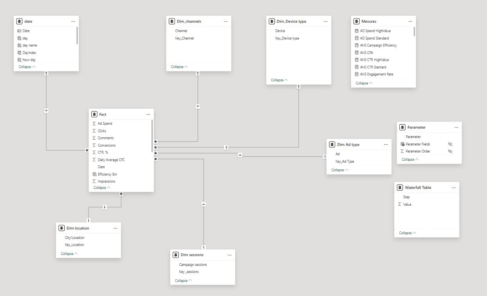

# Marketing Campaigns Analysis using Power BI

An analysis project focused on evaluating the performance, ROI, and customer behavior across different marketing platforms using real campaign data.

---

## 🎯 Project Goal

The main objective was to analyze real-world marketing campaign data to uncover actionable insights, identify high-performing platforms and strategies, and understand the impact of factors like seasonality and spending on overall profitability and efficiency.

---

## 🧼 Data Cleaning & Preparation

Dealing with real-world data often means encountering inconsistencies. The initial dataset contained errors, missing values, and outliers that needed careful handling.

**🔍 Step-by-step:**

1.  **Initial Exploration & Statistical Analysis:**
    * Performed basic statistical analysis to understand data distribution.
    * Scanned for patterns, logic, and inconsistencies to guide the cleaning process without losing important info.
2.  **Outlier Investigation:**
    * Initial analysis revealed significant outliers. Statistical checks confirmed these were valid data points representing two distinct campaign segments: Regular and High-Value.
3.  **Handling Missing/Unknown Values:**
    * **Items:** Used `UNIQUE` and `XLOOKUP` in Excel to fill missing product names based on prices.
    * **Order Type/Payment:** Filled missing values based on observed distribution patterns (49% Takeaway, 51% In-store).
    * **Dates:** Checked data types and duplicates. Some inconsistencies remained unresolved due to lack of clear linkage and were preserved.

**✅ Result:**
Cleaned ~95% of the data. Around 400 rows (5%) remained dirty but were preserved for transparency.

---

## 📈 Data Modeling

To facilitate robust analysis and KPI calculation, a **Star Schema** was developed:

* **Fact Table:** Containing transactional data (spend, conversions, revenue, etc.).
* **Dimension Tables:** Providing context (e.g., Dates, Platforms, Campaigns, Locations, Devices).

Relationships were established between the Fact and Dimension tables. Key Performance Indicators (KPIs) were created using DAX, including:

* **CPA** (Cost Per Acquisition)
* **ROAS** (Return On Ad Spend)
* **CTR** (Click-Through Rate)
* **Conversion Rate**
* **Engagement Rate**

---

## 🛠️ Tools Used

* **Power BI:** For data modeling, DAX calculations, visualization, and interactive dashboard creation.
* **Excel:** for cleaning the data first and doing the statical analysis

---

## 📊 Power BI Dashboards & Key Findings

Three distinct dashboard pages were created to provide comprehensive insights:

1.  **Overview Dashboard:**
    * Provides a high-level view of performance.
    * Features clear segmentation between "Regular" and "High-Value" campaigns, allowing for immediate comparison and understanding of different campaign types.

2.  **Deep Analysis Dashboard:**
    * Allows for granular analysis based on:
        * Platforms (Pinterest, Facebook, Instagram)
        * Countries
        * Devices
        * Marketing Funnel performance.

3.  **Engagement Dashboard:**
    * Focuses on identifying which platforms excel at building awareness (high engagement) versus those driving conversions (high conversion rates).
    * 
    * 
    * 
    * 
    * 
    * 

**📌 Key Insights Uncovered:**

* **Platform Performance:**
    * **Pinterest:** Achieved the highest **ROI** despite lower engagement metrics.
    * **Facebook:** Showed strong engagement but weaker conversion rates, suggesting suitability for **brand awareness** campaigns.
    * **Instagram:** Demonstrated a balanced performance between engagement and conversions.
* **Seasonality:**
    * **Winter:** Higher spending and higher returns, but **lower efficiency (ROAS/CPA)**.
    * **Summer:** More **cost-efficient** campaigns despite potentially lower overall spend/return.
* **Spending vs. Profit:** Confirmed that higher ad spend does not always guarantee higher profit or better ROI. Efficiency varies significantly.

---

## ✅ Conclusion

This analysis highlights the critical importance of **data segmentation** (like separating high-value campaigns) and **well-defined KPIs** in marketing analytics. These practices enable clearer insights into campaign effectiveness and facilitate better-informed strategic decisions, revealing patterns often missed by surface-level observation.

---

## 🔗 Live Demo

Explore the interactive Power BI dashboard for this project here:
[**View Interactive Dashboard**](https://lnkd.in/dpYJUQJn)

---

💬 **Feedback Welcome!**
If you have any suggestions, improvements, or questions — please leave a comment or open an issue! I’d love to hear your thoughts 😊

Don’t forget to star ⭐ the repository if you found it useful. Thanks! 🙌
